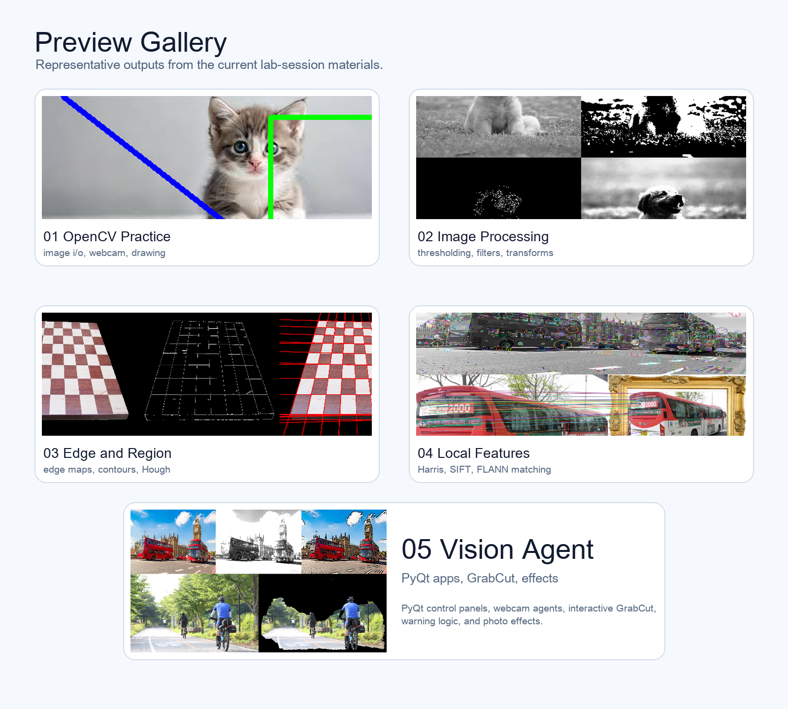

# Computer Vision Lab Session

Lecture-based computer vision materials organized around a single `lab-session/` directory.

The repository is built as a hands-on companion to class slides: each session includes a short guide, a notebook, runnable Python examples, and sample assets for practice.


## What This Repo Looks Like


- `lab-session/01-opencv-practice`: image I/O, webcam capture, drawing, and mouse interaction
- `lab-session/02-image-processing-basics`: thresholding, morphology, filtering, histogram equalization, and geometric transforms
- `lab-session/03-edge-and-region`: Sobel, Canny, contours, Hough transform, superpixels, and region features
- `lab-session/04-local-features`: Harris corners, SIFT keypoints, descriptors, and FLANN matching
- `lab-session/05-vision-agent`: PyQt-based vision applications, GrabCut, monitoring logic, and photo effects

## Preview Gallery



## Quick Start

```bash
pip install opencv-python matplotlib numpy notebook scikit-image PyQt5
```

Then open any lecture folder under `lab-session/` and start with the notebook or the example scripts.

## Session Map

| Session | Notebook | Focus |
| --- | --- | --- |
| [01 OpenCV Practice](lab-session/01-opencv-practice) | [`opencv_practice_lab.ipynb`](lab-session/01-opencv-practice/opencv_practice_lab.ipynb) | basic OpenCV workflow, webcam, drawing, mouse events |
| [02 Image Processing Basics](lab-session/02-image-processing-basics) | [`image_processing_basics_lab.ipynb`](lab-session/02-image-processing-basics/image_processing_basics_lab.ipynb) | thresholding, morphology, filtering, transforms |
| [03 Edge and Region](lab-session/03-edge-and-region) | [`edge_and_region_lab.ipynb`](lab-session/03-edge-and-region/edge_and_region_lab.ipynb) | edge detection, contours, Hough, superpixels |
| [04 Local Features](lab-session/04-local-features) | [`local_features_lab.ipynb`](lab-session/04-local-features/local_features_lab.ipynb) | Harris, SIFT, feature matching |
| [05 Vision Agent](lab-session/05-vision-agent) | [`vision_agent_lab.ipynb`](lab-session/05-vision-agent/vision_agent_lab.ipynb) | PyQt interfaces and interactive vision apps |

## Notes

- Every session folder includes its own `README.md`, `ipynb`, `examples/`, and `data/`.
- GUI examples such as webcam windows or PyQt apps should be run on a local desktop environment.
- The `05-vision-agent` session requires `PyQt5`.
