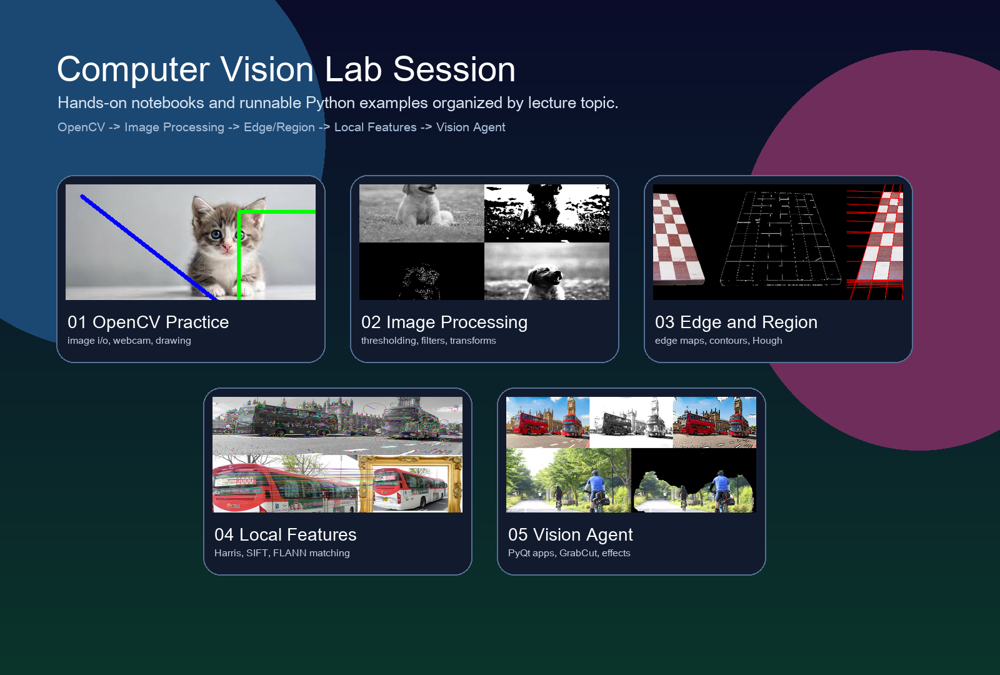
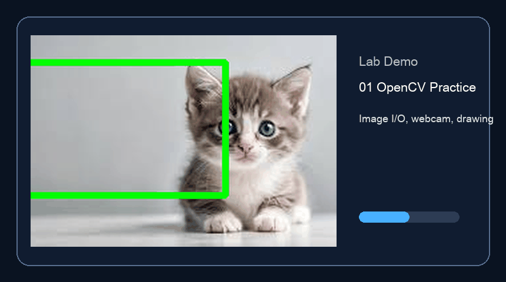
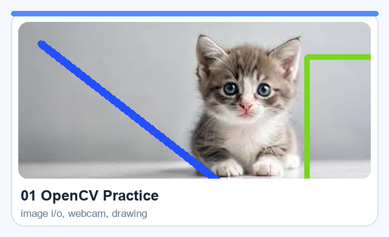
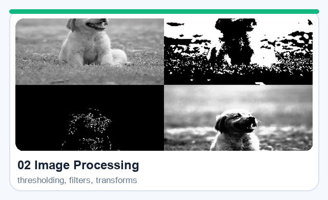
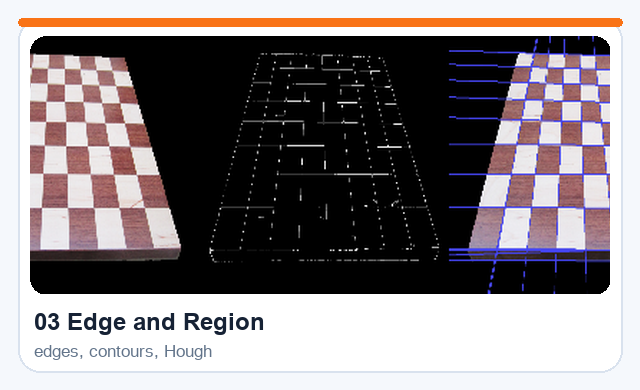
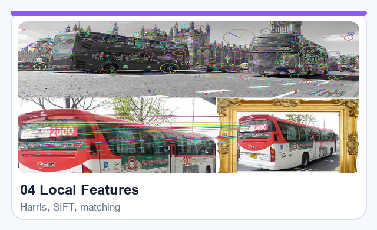
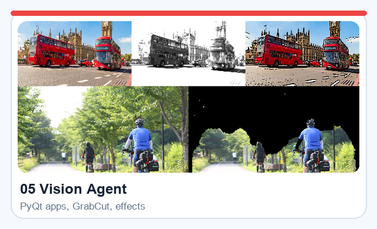
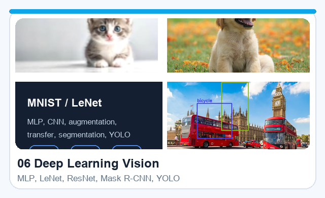

# Computer Vision Lab Session

<p align="center">
  
</p>

## Demo

<p align="center">
  
</p>

## Lab Sessions

<table>
  <tr>
    <td width="50%" valign="top">
      <a href="lab-session/01-opencv-practice">
        
      </a>
      <b>01 OpenCV Practice</b><br>
      <sub>image I/O, webcam capture, drawing, and mouse interaction</sub>
    </td>
    <td width="50%" valign="top">
      <a href="lab-session/02-image-processing-basics">
        
      </a>
      <b>02 Image Processing Basics</b><br>
      <sub>thresholding, morphology, filtering, histogram equalization, and transforms</sub>
    </td>
  </tr>
  <tr>
    <td width="50%" valign="top">
      <a href="lab-session/03-edge-and-region">
        
      </a>
      <b>03 Edge and Region</b><br>
      <sub>Sobel, Canny, contours, Hough transform, superpixels, and region features</sub>
    </td>
    <td width="50%" valign="top">
      <a href="lab-session/04-local-features">
        
      </a>
      <b>04 Local Features</b><br>
      <sub>Harris corners, SIFT keypoints, descriptors, and FLANN matching</sub>
    </td>
  </tr>
  <tr>
    <td width="50%" valign="top">
      <a href="lab-session/05-vision-agent">
        
      </a>
      <b>05 Vision Agent</b><br>
      <sub>PyQt interfaces, webcam agents, GrabCut, monitoring logic, and photo effects</sub>
    </td>
    <td width="50%" valign="top">
      <a href="lab-session/06-deep-learning-vision">
        
      </a>
      <b>06 Deep Learning Vision</b><br>
      <sub>MNIST, LeNet, augmentation, pre-trained ResNet, Mask R-CNN, and YOLO</sub>
    </td>
  </tr>
  <tr>
    <td colspan="2" valign="top">
      <sub>The lab numbering starts from lecture <code>#2</code>, so <code>06-deep-learning-vision</code> corresponds to lecture <code>#7</code>.</sub>
    </td>
  </tr>
</table>

## Quick Start

```bash
pip install opencv-python matplotlib numpy notebook scikit-image PyQt5 torch torchvision torchaudio ultralytics
```

Then open any lecture folder in `lab-session/` and start with the notebook or the scripts in `examples/`.

## Repository Layout

```text
lab-session/
├── 01-opencv-practice/
├── 02-image-processing-basics/
├── 03-edge-and-region/
├── 04-local-features/
├── 05-vision-agent/
└── 06-deep-learning-vision/
```

## Notes

- Every session includes its own `README.md`, `ipynb`, `examples/`, and `data/`.
- GUI and webcam examples should be run on a local desktop environment.
- `05-vision-agent` requires `PyQt5`.
- `06-deep-learning-vision` uses `PyTorch` and `Ultralytics YOLO`, and pre-trained weights may download on first run.
